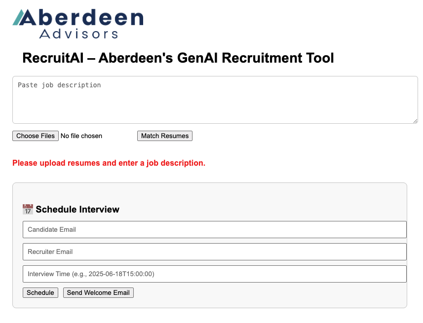
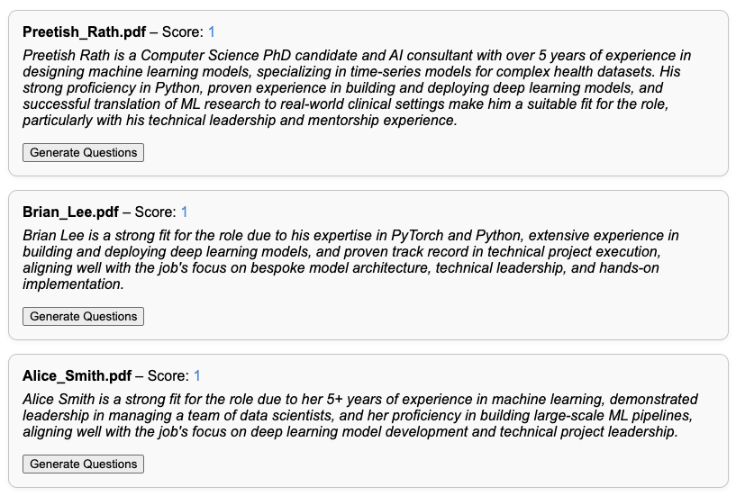
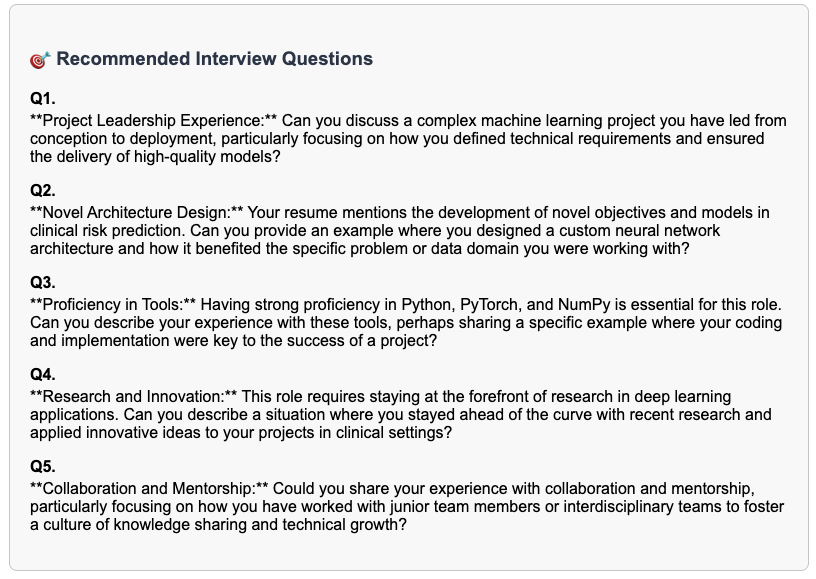

# RecruiterAI

**RecruiterAI** is Aberdeen's internal GenAI-powered recruitment assistant that automates resume screening, interview question generation, calendar scheduling, and candidate communication — all through an intuitive web interface. By combining large language models (LLMs), **LangChain**, and **retrieval-augmented generation (RAG)**, this tool accelerates recruiter workflows with smart, contextual, and explainable recommendations.

<!-- RecruiterAI Screenshots -->
<div align="center">
  <table>
    <tr>
      <td colspan="2" align="center">
        
      </td>
    </tr>
    <tr>
      <td>
        
      </td>
      <td>
        
      </td>
    </tr>
  </table>
</div>

---

## Features

- AI-powered resume-to-job-description matching via vector search and semantic retrieval
- LLM-generated interview questions tailored to each candidate and role
- Concise fit summaries powered by prompt-engineered GPT-4o completions
- Google Calendar-based interview scheduling *(placeholder — Calendar API integration pending)*
- Automated welcome email for selected candidates *(placeholder — Gmail API integration pending)*

---

## Tech Stack

### Frontend — `React + Vite`

- React 18 with Hooks
- TypeScript 5
- Tailwind CSS for styling
- Axios for async API requests

### Backend — `FastAPI + LangChain`

- `FastAPI` — Python async web API framework
- `PyMuPDF` (`fitz`) — PDF text extraction from resumes
- `LangChain` — RAG pipeline using `RetrievalQA` and `OpenAIEmbeddings`
- `FAISS` — In-memory vector store for document retrieval
- `RecursiveCharacterTextSplitter` — Chunks long resumes into semantically meaningful segments
- `OpenAI GPT-4o` — Generates fit summaries and tailored interview questions
- `google-api-python-client` — Google Calendar and Gmail integration (scaffolded)

---

## GenAI & RAG Pipeline

RecruiterAI uses **LangChain's `RetrievalQA` chain** with **FAISS vector search** to semantically compare uploaded resumes against a job description. Top-matching candidates are surfaced by cosine similarity, then **GPT-4o completions** generate:

- **1–2 sentence fit summaries** explaining why each candidate matches the role
- **5 contextual interview questions** tailored to the candidate's resume and the job description

Resume text is chunked with `RecursiveCharacterTextSplitter` (chunk size 500, overlap 100) before being embedded via `OpenAIEmbeddings` and indexed in FAISS.

---

## Run Locally

### Prerequisites

- Python 3.10+
- Node.js 18+
- An OpenAI API key (see [How to Get an OpenAI API Key](#how-to-get-an-openai-api-key))

### 1. Clone the repository

```bash
git clone https://github.com/your-org/recruiterai.git
cd recruiterai
```

### 2. Set up the backend

```bash
python -m venv venv
source venv/bin/activate      # On Windows: venv\Scripts\activate
pip install -r requirements.txt
```

### 3. Configure environment variables

Create a `.env` file inside the `backend/` directory:

```env
OPENAI_API_KEY=sk-your-key-here
```

### 4. Start the backend

```bash
cd backend
uvicorn main:app --reload
```

The API will be available at `http://localhost:8000`.

### 5. Start the frontend

In a separate terminal:

```bash
cd frontend
npm install
npm run dev
```

The UI will be available at `http://localhost:5173`.

---

## How to Get an OpenAI API Key

1. Go to [https://platform.openai.com/account/api-keys](https://platform.openai.com/account/api-keys).
2. Log in or create a free account.
3. Click **"Create new secret key"**.
4. Copy the generated key (starts with `sk-`). You won't be able to see it again, so store it securely.
5. Add it to `backend/.env` as shown in step 3 above.

---

## Folder Structure

```
recruiterai/
├── requirements.txt             # Python dependencies
├── backend/
│   ├── main.py                  # Uvicorn entry point
│   ├── resume_matcher.py        # RAG pipeline, /match_resumes and /generate_questions endpoints
│   ├── scheduler.py             # /schedule_interview endpoint (Google Calendar placeholder)
│   ├── emailer.py               # /send_welcome_email endpoint (Gmail placeholder)
│   ├── .env                     # API keys (not committed)
│   └── data/
│       ├── job_description.txt  # Sample job description
│       └── resumes/             # Sample candidate PDFs
└── frontend/
    ├── index.html
    ├── src/
    │   ├── App.tsx              # Root component and routing logic
    │   ├── main.tsx             # React entry point
    │   └── components/
    │       ├── JobDescriptionInput.tsx
    │       ├── UploadResumes.tsx
    │       ├── CandidateSelector.tsx
    │       ├── InterviewScheduler.tsx
    │       └── FinalDecision.tsx
    └── public/
        └── AberdeenLogo.png
```
